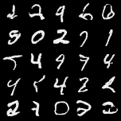
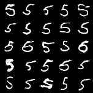

# 🧠 MNIST GAN & Conditional GAN (cGAN) — PyTorch

This repository contains **clean, from-scratch PyTorch implementations** of:

* **Vanilla GAN** (Generative Adversarial Network)
* **Conditional GAN (cGAN)**

Both models are trained on the **MNIST handwritten digits dataset** and include:

* training scripts
* model checkpoints
* evaluation utilities
* generated image grids
* loss curve visualizations

The project is intended for **learning, experimentation, and academic demonstration** of GAN fundamentals and conditional generation.

---

## 📂 Repository Structure

```
.
├── src/
│   ├── dataset.py              # MNIST DataLoader
│   ├── model.py                # Vanilla GAN (Generator + Discriminator)
│   ├── advanced_model.py       # Conditional GAN (cGenerator + cDiscriminator)
│   ├── train_gan.py            # Train vanilla GAN
│   ├── train_cgan.py           # Train conditional GAN
│   ├── eval_gan.py             # GAN evaluation & evolution
│   └── eval_cgan.py            # cGAN digit-conditioned evaluation
│
├── gan_results/                # GAN generated samples per epoch
├── gan_checkpoints/            # GAN model checkpoints
├── gan_evaluation/             # GAN evaluation outputs
│
├── cgan_results/               # cGAN generated samples & losses
├── cgan_checkpoints/           # cGAN model checkpoints
│
├── gan_losses.png              # GAN loss curves
├── cGAN_losses.png             # cGAN loss curves
│
└── README.md
```

---

## 🧪 Models Overview

### 🔹 Vanilla GAN

* Input: random noise vector $z \sim \mathcal{N}(0, 1)$
* Output: generated MNIST-like digit images
* Unconditional generation

**Generator**

* Fully connected layer → reshape
* Transposed convolutions (upsampling)
* Sigmoid output in $[0,1]$

**Discriminator**

* Convolutional layers
* Binary classification: real vs fake

---

### 🔹 Conditional GAN (cGAN)

The cGAN conditions image generation on **digit labels (0–9)**.

**Key idea:**

$$
G(z, y) \rightarrow x \quad , \quad D(x, y) \rightarrow {0,1}
$$

* Generator input: **noise + one-hot encoded label**
* Discriminator input: **image + label map channel**

This enables **controlled generation**, e.g. “generate only digit 5”.

---

## 🚀 How to Run

### 1️⃣ Install dependencies

```bash
pip install torch torchvision matplotlib
```

### 2️⃣ Train Vanilla GAN

```bash
cd src
python train_gan.py
```

Outputs:

* `gan_results/epoch_*.png`
* `gan_checkpoints/*.pth`
* `gan_losses.png`

---

### 3️⃣ Train Conditional GAN

```bash
cd src
python train_cgan.py
```

Outputs:

* `cgan_results/epoch_*.png`
* `cgan_checkpoints/*.pth`
* `cGAN_losses.png`

---

## 📊 Training Loss Curves

### GAN Losses


### cGAN Losses


---

## 🖼️ Generated Samples

### 🎲 Vanilla GAN — Final Samples



---

### 🔢 Conditional GAN — Digit-Specific Generation

Example: **digit 5 only**



---

## 🔄 Generator Evolution (GAN)

The same noise vector is passed through generators saved at different epochs to visualize training progression:

```
gan_evaluation/evolution_epoch_0.png
gan_evaluation/evolution_epoch_50.png
gan_evaluation/evolution_epoch_100.png
```

This shows how structure gradually emerges from noise.

---

## 🎯 Key Learning Outcomes

* Understand GAN vs cGAN architectures
* Learn conditional generation using labels
* Implement stable GAN training loops
* Visualize generator evolution over time
* Work with PyTorch DataLoaders & checkpoints

---

## 🛠️ Technologies Used

* Python
* PyTorch
* TorchVision
* Matplotlib
* MNIST Dataset

---

## 📌 Notes

* Designed for **educational clarity**, not heavy optimization
* Easily extensible to other datasets (Fashion-MNIST, CIFAR-10)
* Clear separation between **model**, **training**, and **evaluation**

---

## 📜 License

This project is open for **academic and educational use**.

---

⭐ If you find this useful, feel free to star the repository!

